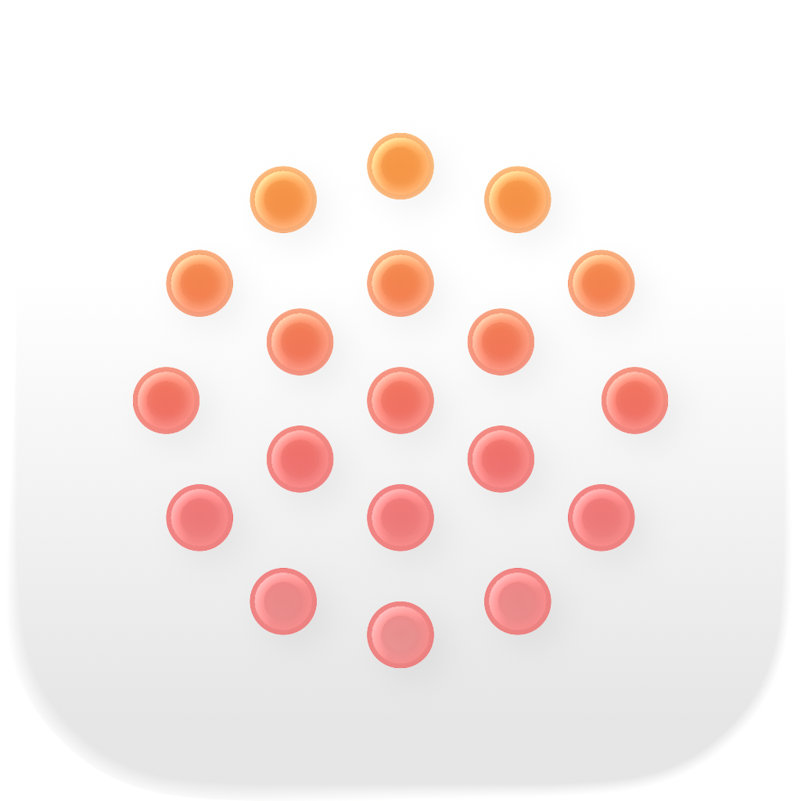
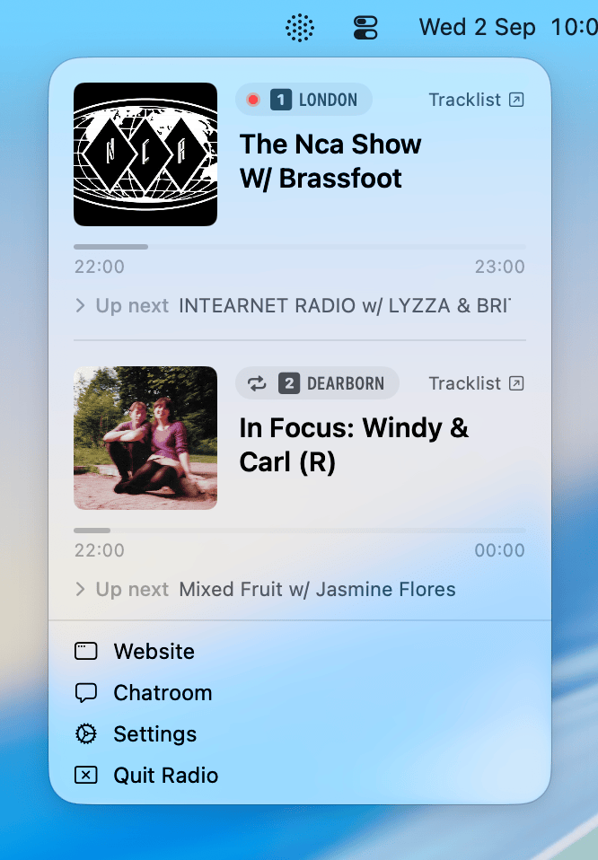
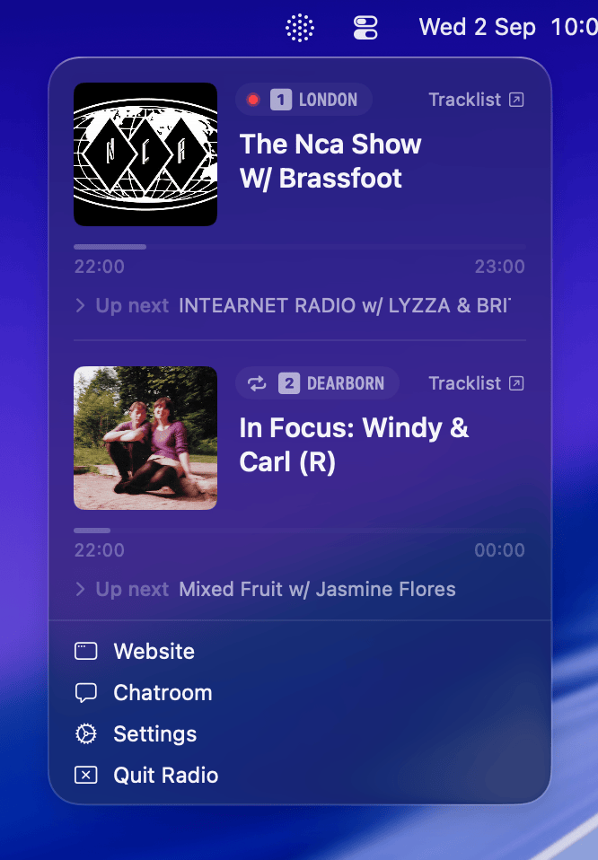

<p align="center">
  
</p>

<h1 align="center">Radio</h1>

<p align="center">A macOS menu-bar app for streaming NTS Radio.</p>

Radio puts [NTS Radio](https://www.nts.live) channels 1 and 2 in your menu bar, with live now-playing/up-next info, a floating tracklist window, and Now Playing / media-key integration.

The app has no Dock icon and no main window (`LSUIElement`). It lives entirely in the menu bar: click the status icon to drop down a floating panel showing both channels.

> **Unofficial.** Radio is an independent project and is not affiliated with, endorsed by, or associated with NTS Radio. All audio streams, schedule data, and the NTS name and logo belong to NTS. It streams the same public live feeds as [nts.live](https://www.nts.live).

<p align="center">
  
  
</p>

## Installation

Download the latest `.dmg` from the [GitHub Releases page](https://github.com/garrill/Radio/releases).

## Building

```bash
xcodebuild -scheme Radio -destination 'platform=macOS' build
```

Or just open `Radio.xcodeproj` in Xcode (Cmd+R to run, Cmd+U to test). The one dependency, [Sparkle](https://sparkle-project.org) for auto-updates, is resolved by Xcode's package manager on first build.

## Anatomy of the panel

```
┌ AppDelegate.swift ─── status item, panel window, positioning ──┐
│                                                                │
│  ┌ ContentView.swift ── panel background/blur/shadow ───────┐  │
│  │                                                          │  │
│  │  ┌ ChannelRow.swift ── artwork, badge, title, progress ┐ │  │
│  │  │ (uses MarqueeComponents / AnimationComponents)      │ │  │
│  │  └─────────────────────────────────────────────────────┘ │  │  
│  │  ┌ ChannelRow.swift ───────────────────────────────────┐ │  │  
│  │  └─────────────────────────────────────────────────────┘ │  │
│  │  ┌ MenuComponents.swift ── Bottom menu items ──────────┐ │  │
│  │  └─────────────────────────────────────────────────────┘ │  │
│  └──────────────────────────────────────────────────────────┘  │
└────────────────────────────────────────────────────────────────┘
```

Row/panel sizing comes from `ArtworkSize.swift`. Data shown in each row comes from `NTSModels.swift`/`NTSService.swift`; playback state (buffering, play/stop icon) comes from `RadioPlayer.swift`. The status-bar and app icon are drawn in `NTSLogoImage.swift`. Clicking "Tracklist" opens a window managed by `TracklistWindowManager.swift`; "Settings" opens the scene in `SettingsView.swift`.

## Architecture

`AppDelegate` is the composition root: it owns the single `RadioPlayer` and `NTSService` instances for the app's lifetime and injects them into SwiftUI via `.environmentObject`.

- **`RadioPlayer`** wraps a single `AVPlayer` for whichever of the two live streams is active, and integrates with `MPRemoteCommandCenter`/`MPNowPlayingInfoCenter` for media-key and Control Center support.
- **`NTSService`** polls `https://www.nts.live/api/v2/live` every 30s while the panel is open, decoding into the models in `NTSModels.swift`. A persistent `NWPathMonitor` tracks connectivity and triggers a re-fetch on reconnect.
- **View layer** is split by concern rather than kept in one file: `ContentView` (panel root) → `ChannelRow` (per-channel row) → `MarqueeComponents`/`AnimationComponents` (scrolling text, waveform, live-dot) and `MenuComponents` (bottom action rows). Follow this split when adding UI rather than growing a single file.

## License

MIT — see [LICENSE](LICENSE). Note the disclaimer above: the MIT license covers Radio's own source, not NTS's streams, branding, or content.
